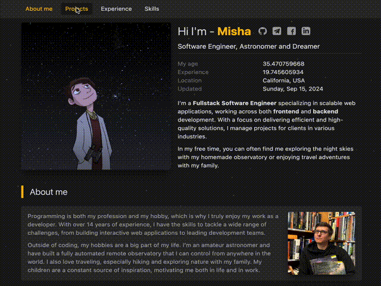
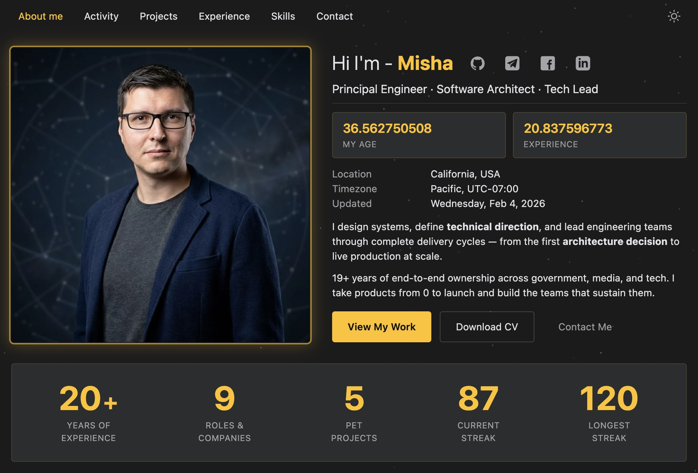
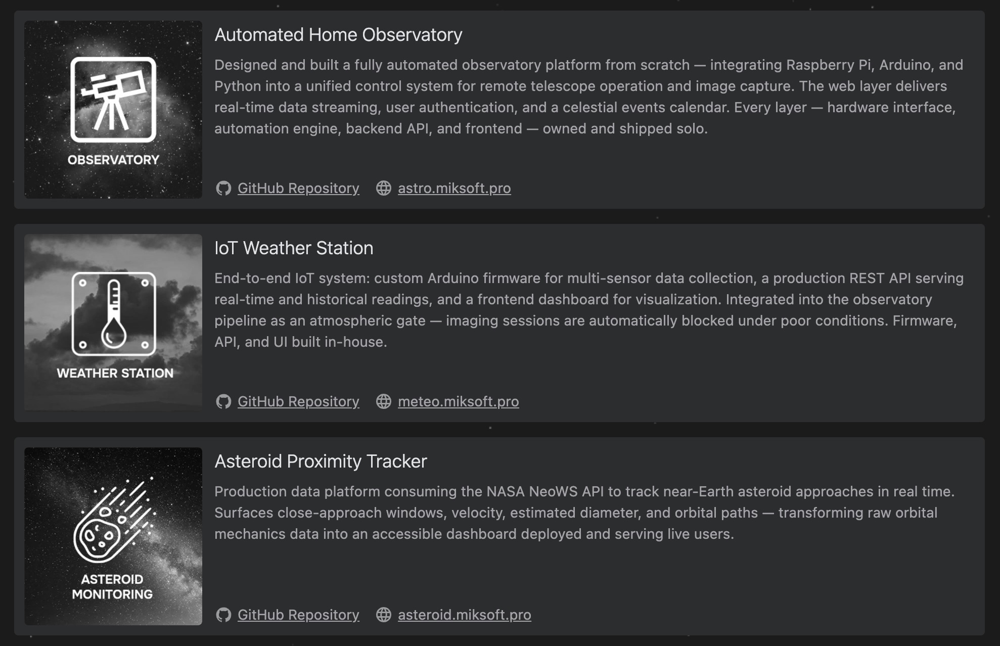
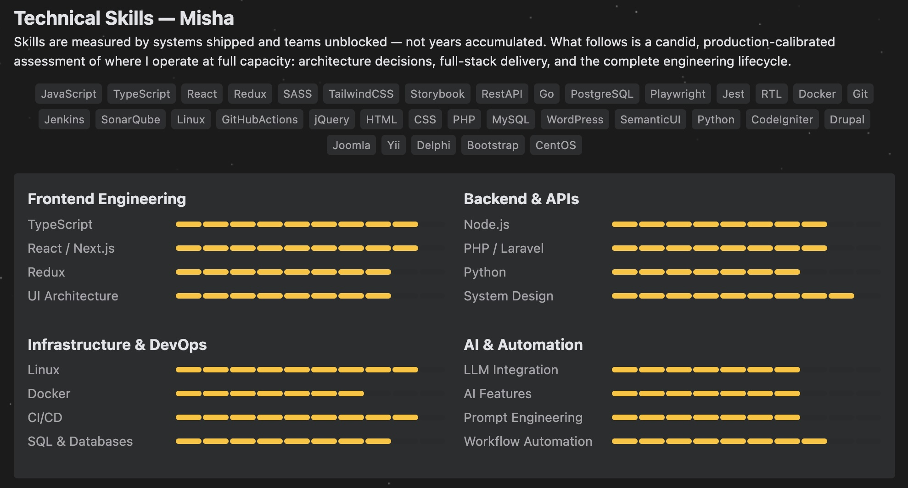

<a id="top"></a>

A modern and flexible portfolio template for React and Next.js developers. Perfect for showcasing your skills, experience, and projects. Clean, professional design, easy customization, and fast loading — everything you need to stand out from the crowd. A great choice for both personal brands and freelancers who value a convenient and stylish portfolio.
<!-- PROJECT TITLE -->
<div align="center">
  
  <h3>Create Your Personal Developer Portfolio</h3>
  <a href="CHANGELOG.md" target="_blank">Changelog</a>
  ·
  <a href="https://miksoft.pro" target="_blank">Demo</a>
  ·
  <a href="https://github.com/miksrv/developer-portfolio-website/issues/new?assignees=miksrv&labels=bug&projects=&template=1-bug.yml&title=%5BBug%5D%3A+">Report Bug</a>
  ·
  <a href="https://github.com/miksrv/developer-portfolio-website/issues/new?assignees=miksrv&labels=enhancement&template=2-feature-request.yml&title=%5BFeature%5D%3A+">Request Feature</a>
  ·
  <a href="#contact">Contact</a>
</div>

<br />

<!-- PROJECT BADGES -->
<div align="center">

[![Contributors][contributors-badge]][contributors-url]
[![Forks][forks-badge]][forks-url]
[![Stargazers][stars-badge]][stars-url]
[![Issues][issues-badge]][issues-url]
[![MIT License][license-badge]][license-url]

[](https://github.com/miksrv/developer-portfolio-website/actions/workflows/checks.yml)
[](https://github.com/miksrv/developer-portfolio-website/actions/workflows/deploy.yml)
[](https://sonarcloud.io/summary/new_code?id=miksrv_developer-portfolio-website)
[](https://sonarcloud.io/summary/new_code?id=miksrv_developer-portfolio-website)

</div>

---

<!-- TABLE OF CONTENTS -->
### Table of Contents

- [Key Features](#key-features)
- [Why Use This Portfolio Template?](#why-use-this-portfolio-template)
- [Built With](#built-with)
- [About of Project](#about-of-project)
- [How to use](#how-to-use)
- [Contributing](#contributing)
- [Contact](#contact)

<!-- KEY FEATURES -->
### Key Features:
- **Built with React and Next.js**: Fast, scalable, and SEO-friendly framework.
- **Customizable Design**: Easily adjust the layout, colors, and sections to suit your needs.
- **Responsive Layout**: Optimized for all screen sizes, ensuring a seamless experience on any device.
- **Skills and Project Showcases**: Display your technical expertise and featured projects with progress bars, icons, and descriptions.
- **Smooth Animations**: Modern CSS animations to enhance the user experience.

<p align="right">
  (<a href="#top">Back to top</a>)
</p>

### Why Use This Portfolio Template?

- **Professional Presentation**: A portfolio is more than just a collection of work—it's a personal brand statement. With this template, you can professionally showcase your skills, projects, and expertise, leaving a lasting impression on potential employers or clients.

- **Boost Your Online Visibility**: In today’s digital world, a strong online presence is key to getting noticed. This portfolio is optimized for SEO, helping to increase your visibility in search engines, so your profile is more likely to be found by the right people.

- **Stand Out from Resumes**: A portfolio goes beyond a simple resume, offering a dynamic, interactive way to demonstrate your experience and technical knowledge. With engaging animations and structured project showcases, you can tell a compelling story about your professional journey.

- **Customizable and Easy to Use**: This template is built with React and Next.js, offering a clean codebase and a flexible structure that can be easily adapted to your unique needs. Whether you're a developer starting out or an experienced professional, it’s simple to personalize and deploy.

<p align="right">
  (<a href="#top">Back to top</a>)
</p>

### Built With

The Arduino Weather Station project leverages a wide range of technologies across various layers of the system:

- [![JavaScript][js-badge]][js-url] Core languages used in frontend development.
- [![TypeScript][ts-badge]][ts-url] TypeScript extends JavaScript by adding types to the language.
- [![NextJS][nextjs-badge]][nextjs-url] React-based frontend framework for building the user interface.
- [![NodeJS][nodejs-badge]][nodejs-url] JavaScript runtime used for frontend development and package management.
- [![Sass][sass-badge]][sass-url] Styling the user interface.
- [![GitHub Actions][githubactions-badge]][githubactions-url] Continuous integration and deployment pipeline for automating tests and deployment processes.

<p align="right">
  (<a href="#top">Back to top</a>)
</p>

<!-- ABOUT OF PROJECT -->
### About of Project

This project is a complete solution for building a high-quality developer portfolio website, perfect for showcasing your skills, projects, and experiences in a sleek and modern design. Built with React and Next.js, this template is optimized for performance and SEO, ensuring that your portfolio stands out not only in appearance but also in search engine visibility. It’s fully customizable, allowing you to adapt the design, structure, and content to match your personal branding or freelance work.



Designed with developers in mind, the template features dedicated sections for displaying technical skills with animated progress bars, detailed project showcases, and an about section to introduce yourself to potential clients or employers. The layout is fully responsive, ensuring a seamless experience across devices, from desktop to mobile. Additionally, the use of smooth CSS animations adds a dynamic feel to the portfolio, enhancing user engagement without sacrificing speed or performance.



Whether you’re looking to establish a strong online presence as a developer or need a professional portfolio to support your freelance career, this project offers the flexibility and functionality to create an impressive, personalized site. Easily deploy it to platforms like Vercel or host it on any provider supporting Next.js applications.



Feel free to use this repository for any purpose related to the development of virtual business cards. I am always ready to discuss any questions related to the use of this repository and help you in its work.

<p align="right">
  (<a href="#top">Back to top</a>)
</p>

### How to Use

1. **Install Prerequisites**: Ensure you have [NodeJS](https://nodejs.org/en/download/) and [Yarn](https://yarnpkg.com/getting-started/install) installed on your system.

2. **Clone the Repository**: Clone [this repository](https://github.com/miksrv/developer-portfolio-website.git) to your local machine:

   ```bash
   git clone https://github.com/miksrv/developer-portfolio-website.git
   ```

3. **Install Dependencies**: Navigate to the project directory and install all necessary dependencies:

   ```bash
   cd developer-portfolio-website
   yarn install
   ```

4. **Run the Development Server**: After the installation is complete, start the local development server:

   ```bash
   yarn dev
   ```

5. **Access the Application**: Open your browser and go to [http://localhost:3000/](http://localhost:3000/) to view the portfolio.

<p align="right">
  (<a href="#top">Back to top</a>)
</p>

### Contributing

Contributions are what make the open-source community an incredible environment for learning, inspiration, and innovation. Your contributions are highly valued and greatly appreciated, whether it’s reporting bugs, suggesting improvements, or creating new features.

To contribute:

1. **Fork the project** by clicking the "Fork" button at the top of this page.
2. **Clone your fork locally**:
    ```bash
    git clone https://github.com/your-username/arduino-weather-station.git
    ```
3. **Create a new feature branch** for your work:
    ```bash
    git checkout -b feature/AmazingFeature
    ```
4. **Make your changes**, and ensure they meet the project's coding standards.
5. **Commit your changes**:
    ```bash
    git commit -m "Add AmazingFeature"
    ```
6. **Push your changes** to your forked repository:
    ```bash
    git push origin feature/AmazingFeature
    ```
7. **Open a pull request** from your feature branch to the main repository.

#### Creating a New Release

Once your pull request has been approved and merged, follow these steps to create a new release if your changes require it:

1. **Ensure your branch is up-to-date with `main`**:
    ```bash
    git checkout main
    git pull origin main
    ```
2. **Add details to the `CHANGELOG.md`**:
    - Update the changelog with a clear description of the new feature, improvement, or bug fix.
    - Use an appropriate versioning convention (e.g., `v1.0.1`, `v1.1.0`).

3. **Create a new tag** for the release:
    ```bash
    git tag -a vX.X.X -m "Release notes for version X.X.X"
    ```
    - Replace `vX.X.X` with the new version (e.g., `v1.0.1`).
    - Write detailed release notes in the tag message, highlighting key changes or new features.

4. **Push the tag and changes** to the repository:
    ```bash
    git push origin vX.X.X
    ```
    - This will automatically trigger the GitHub action to create a new release if there are changes in `CHANGELOG.md` and a new tag is present.

5. **Open a pull request** for your branch if not yet merged:
    - Once the pull request is merged into `main` and the new tag is pushed, a GitHub Release will be created automatically.

We encourage contributions of all kinds, whether big or small. Your efforts help improve the project for everyone!

<p align="right">
  (<a href="#top">Back to top</a>)
</p>

### Contact

Misha - [miksoft.pro](https://miksoft.pro)

<p align="right">
  (<a href="#top">Back to top</a>)
</p>

<!-- MARKDOWN VARIABLES (LINKS, IMAGES) -->
[contributors-badge]: https://img.shields.io/github/contributors/miksrv/developer-portfolio-website.svg?style=for-the-badge
[contributors-url]: https://github.com/miksrv/developer-portfolio-website/graphs/contributors
[forks-badge]: https://img.shields.io/github/forks/miksrv/developer-portfolio-website.svg?style=for-the-badge
[forks-url]: https://github.com/miksrv/developer-portfolio-website/network/members
[stars-badge]: https://img.shields.io/github/stars/miksrv/developer-portfolio-website.svg?style=for-the-badge
[stars-url]: https://github.com/miksrv/developer-portfolio-website/stargazers
[issues-badge]: https://img.shields.io/github/issues/miksrv/developer-portfolio-website.svg?style=for-the-badge
[issues-url]: https://github.com/miksrv/developer-portfolio-website/issues
[license-badge]: https://img.shields.io/github/license/miksrv/developer-portfolio-website.svg?style=for-the-badge
[license-url]: https://github.com/miksrv/developer-portfolio-website/blob/master/LICENSE.txt

[js-badge]: https://img.shields.io/badge/JavaScript-F7DF1E?logo=javascript&logoColor=000
[js-url]: https://www.javascript.com/
[ts-badge]: https://img.shields.io/badge/TypeScript-3178C6?logo=typescript&logoColor=fff
[ts-url]: https://www.typescriptlang.org/
[nextjs-badge]: https://img.shields.io/badge/Next.js-black?logo=next.js&logoColor=white
[nextjs-url]: https://nextjs.org/
[nodejs-badge]: https://img.shields.io/badge/Node.js-6DA55F?logo=node.js&logoColor=white
[nodejs-url]: https://nodejs.org/
[sass-badge]: https://img.shields.io/badge/Sass-C69?logo=sass&logoColor=fff
[sass-url]: https://sass-lang.com/
[githubactions-badge]: https://img.shields.io/badge/GitHub_Actions-2088FF?logo=github-actions&logoColor=white
[githubactions-url]: https://docs.github.com/en/actions
