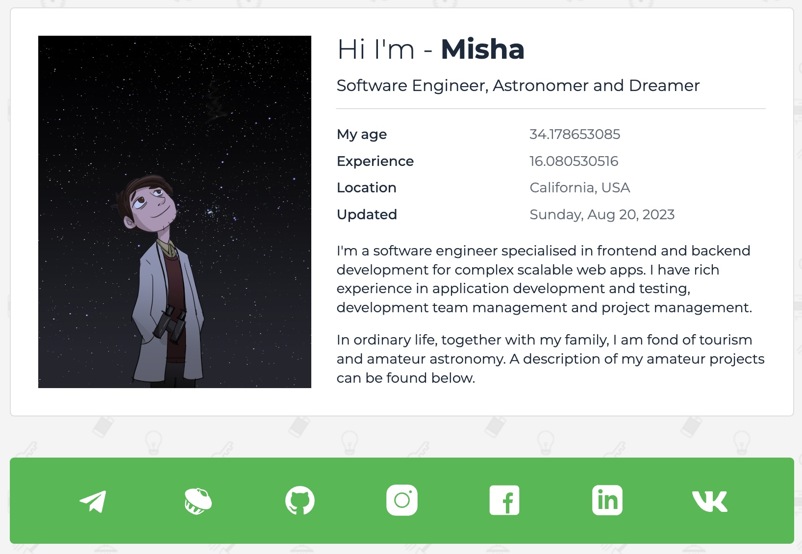

# Personal VCard - NextJS + Typescript

[ DEMO ](https://miksoft.pro)

This repository contains the source code for a virtual business card rewritten using NextJS + Typescript. As a result of the simplified use of components and the rethinking of the architecture, the design has been improved and optimized with the latest development trends in mind.

In the repository you will find sample code that you can use as a template for creating your own business card. In addition, in the future, I will regularly add new features and update the interface to provide the best experience for users.

Feel free to use this repository for any purpose related to the development of virtual business cards. I am always ready to discuss any questions related to the use of this repository and help you in its work.

The project was originally created using React, but then I decided to rewrite it in NextJS in order to learn how to work with server-side rendering (SSR) and static generation (SSG). I chose NextJS because it provides great SEO capabilities. The old version of the ReactJS + TypeScript project is still available at this [link](https://github.com/miksrv/react-personal-webpage).

## How to use

1. Install NodeJS, Yarn and clone this repository.
2. In the repository directory, run the command in the terminal: `yarn install`.
3. After installing the node modules, run the following command in a terminal: `yarn dev` and open a browser at _http://localhost:3000/_.
