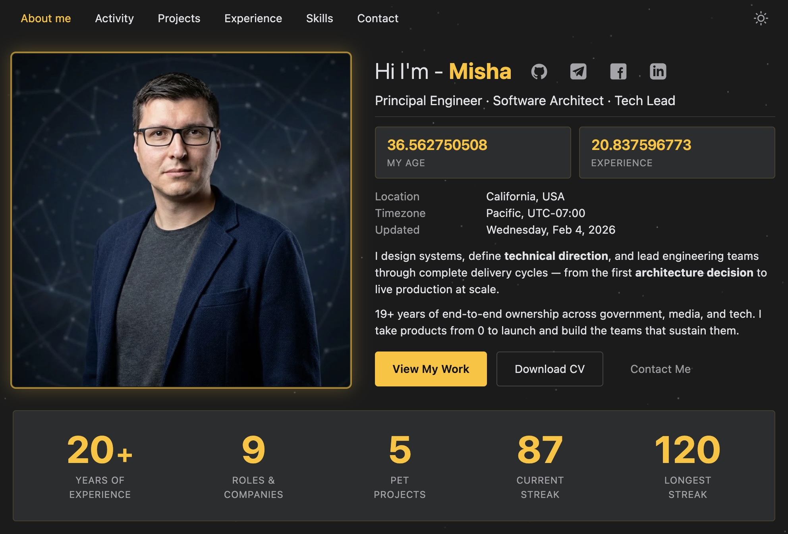
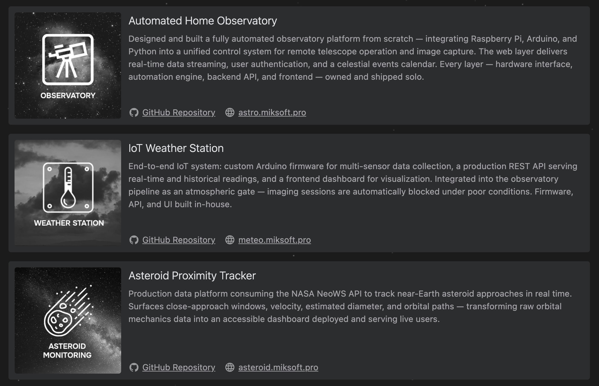
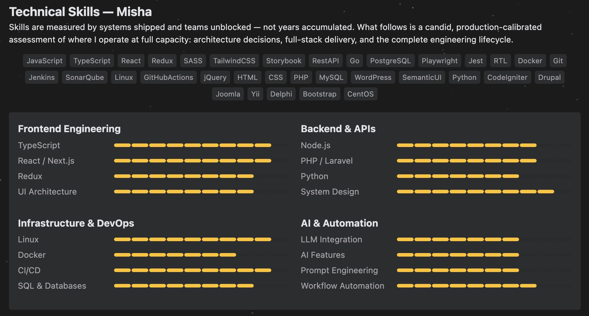

<a id="top"></a>

<!-- PROJECT TITLE -->
<div align="center">
  <h1>Developer Portfolio Website</h1>
  
  <p>A production-ready, SEO-optimized portfolio template built with Next.js and React. Showcase your skills, projects, and experience with a clean, modern design that makes a lasting impression on employers and clients.</p>
  <a href="CHANGELOG.md" target="_blank">Changelog</a>
  ·
  <a href="https://miksoft.pro" target="_blank">Live Demo</a>
  ·
  <a href="https://github.com/miksrv/developer-portfolio-website/issues/new?assignees=miksrv&labels=bug&projects=&template=1-bug.yml&title=%5BBug%5D%3A+">Report Bug</a>
  ·
  <a href="https://github.com/miksrv/developer-portfolio-website/issues/new?assignees=miksrv&labels=enhancement&template=2-feature-request.yml&title=%5BFeature%5D%3A+">Request Feature</a>
  ·
  <a href="#contact">Contact</a>
</div>

<br />

<!-- PROJECT BADGES -->
<div align="center">

[![Contributors][contributors-badge]][contributors-url]
[![Forks][forks-badge]][forks-url]
[![Stargazers][stars-badge]][stars-url]
[![Issues][issues-badge]][issues-url]
[![MIT License][license-badge]][license-url]

[](https://github.com/miksrv/developer-portfolio-website/actions/workflows/checks.yml)
[](https://github.com/miksrv/developer-portfolio-website/actions/workflows/deploy.yml)
[](https://sonarcloud.io/summary/new_code?id=miksrv_developer-portfolio-website)
[](https://sonarcloud.io/summary/new_code?id=miksrv_developer-portfolio-website)

</div>

---

> [!IMPORTANT]
>
> ### Version 2.x.x - Single-Page Landing
>
> Starting from version **2.0.0**, this portfolio has been redesigned as a **single-page landing** - all content is displayed on one page with smooth scrolling and a clean, modern layout.
>
> Looking for the **multi-page version**? The previous implementation with separate pages for skills, experience, and projects is available in earlier releases. The last multi-page release was **[v1.2.2](https://github.com/miksrv/developer-portfolio-website/tree/release/v1.2.2)**.

---

### Table of Contents

- [Key Features](#key-features)
- [Why Use This Portfolio Template?](#why-use-this-portfolio-template)
- [Built With](#built-with)
- [About the Project](#about-the-project)
- [How to Use](#how-to-use)
- [Contributing](#contributing)
- [Contact](#contact)

---

### Key Features

- **Next.js & React** - Blazing-fast static site generation with server-side rendering support and built-in SEO optimization.
- **Single-Page Layout** - All sections on one page with smooth anchor scrolling and a minimal, distraction-free layout.
- **Fully Responsive** - Pixel-perfect on every screen size, from wide desktop monitors to mobile phones.
- **Skills Showcase** - Animated progress bars with segment indicators to visualize your technical proficiency at a glance.
- **Project Gallery** - Rich project cards with images, live links, and GitHub repository references.
- **GitHub Activity Calendar** - Real-time contribution graph powered by `react-github-calendar`.
- **Smooth Animations** - Framer Motion-powered page transitions and entrance animations for a polished, modern feel.
- **Dark Theme** - Elegant dark design with a customizable golden accent color that highlights your personal brand.
- **Static Export** - Outputs pure HTML/CSS/JS via `next export` - deploy anywhere: Vercel, Netlify, GitHub Pages, or any CDN.
- **One-File Content** - All personal data lives in a single `public/data.json` file. No database, no CMS required.

<p align="right">
  (<a href="#top">Back to top</a>)
</p>

### Why Use This Portfolio Template?

- **Make a Strong First Impression** - Your portfolio is your digital business card. This template presents your skills, projects, and experience in a polished, recruiter-friendly layout that communicates professionalism before they read a single line.

- **Rank Higher in Search Results** - Built with Next.js SEO best practices: semantic HTML, per-page meta tags, Open Graph support, and a perfect Lighthouse score. Your profile gets found by the right people - hiring managers, clients, and collaborators.

- **Go Beyond the Resume** - Static PDFs can't show animated skill bars, live GitHub contributions, or interactive project galleries. This portfolio tells your story dynamically, keeping visitors engaged longer and converting views into opportunities.

- **Own Your Data, Own Your Brand** - No third-party platforms, no algorithmic feeds. You control the layout, the content, and the hosting. Update your `data.json` and your entire portfolio reflects the change instantly.

- **Production-Ready from Day One** - CI/CD pipeline via GitHub Actions, SonarCloud code quality analysis, full Jest test suite with coverage reporting, and ESLint + Prettier enforcement. Fork it, personalize it, and ship it with confidence.

<p align="right">
  (<a href="#top">Back to top</a>)
</p>

### Built With

| Technology                                                  | Role                                                |
| ----------------------------------------------------------- | --------------------------------------------------- |
| [![JavaScript][js-badge]][js-url]                           | Core language for frontend logic                    |
| [![TypeScript][ts-badge]][ts-url]                           | Static typing for safer, more maintainable code     |
| [![NextJS][nextjs-badge]][nextjs-url]                       | React framework with SSG, routing, and SEO features |
| [![NodeJS][nodejs-badge]][nodejs-url]                       | Runtime environment and package management          |
| [![Sass][sass-badge]][sass-url]                             | Component-scoped styles with a global theme system  |
| [![GitHub Actions][githubactions-badge]][githubactions-url] | Automated CI/CD pipeline for checks and deployment  |

<p align="right">
  (<a href="#top">Back to top</a>)
</p>

### About the Project

This is a complete, production-ready developer portfolio built with **Next.js**, **React 19**, and **TypeScript**. It is designed to help developers, engineers, and freelancers establish a strong online presence with minimal setup - all content is driven by a single `public/data.json` file, so you can have a personalized portfolio running in minutes.



The template is architected for performance and maintainability. Sections include an animated hero with live age and experience counters, a visual skills breakdown with 10-segment progress bars, a full work experience timeline, and a project gallery - all within a smooth single-page experience powered by Framer Motion transitions.



The build outputs pure static HTML via `next export`, making deployment effortless. Host it on Vercel with one click, push it to GitHub Pages, or serve it from any static file host - no server required. The codebase is clean and well-tested, making it easy to extend with your own sections or integrations.



This project is open-source and free to use for any personal or commercial portfolio purpose. Contributions, suggestions, and feedback are always welcome.

<p align="right">
  (<a href="#top">Back to top</a>)
</p>

### How to Use

1. **Install Prerequisites** - Make sure you have [Node.js](https://nodejs.org/en/download/) and [Yarn](https://yarnpkg.com/getting-started/install) installed.

2. **Clone the Repository**:

    ```bash
    git clone https://github.com/miksrv/developer-portfolio-website.git
    ```

3. **Install Dependencies**:

    ```bash
    cd developer-portfolio-website
    yarn install
    ```

4. **Personalize Your Content** - Edit `public/data.json` with your name, bio, skills, projects, and experience.

5. **Start the Development Server**:

    ```bash
    yarn dev
    ```

6. **Open in Browser** - Visit [http://localhost:3000](http://localhost:3000) to preview your portfolio.

7. **Build for Production**:

    ```bash
    yarn build
    ```

    The static output is exported to the `/out` directory, ready to deploy to any static hosting provider.

<p align="right">
  (<a href="#top">Back to top</a>)
</p>

### Contributing

Open-source thrives on collaboration. Bug reports, feature suggestions, documentation improvements, and code contributions are all genuinely appreciated - no contribution is too small.

**To contribute code:**

1. **Fork** the repository.
2. **Clone** your fork locally:
    ```bash
    git clone https://github.com/your-username/developer-portfolio-website.git
    ```
3. **Create a feature branch**:
    ```bash
    git checkout -b feature/your-feature-name
    ```
4. **Make your changes** and ensure they pass linting and tests:
    ```bash
    yarn eslint:check && yarn test
    ```
5. **Commit** with a descriptive message:
    ```bash
    git commit -m "Add: description of your change"
    ```
6. **Push** to your fork:
    ```bash
    git push origin feature/your-feature-name
    ```
7. **Open a Pull Request** against the `main` branch.

#### Creating a Release

Once a pull request is approved and merged:

1. **Sync with `main`**:
    ```bash
    git checkout main && git pull origin main
    ```
2. **Update `CHANGELOG.md`** with a clear description of the changes using [Semantic Versioning](https://semver.org/) (e.g., `v2.1.0`).

3. **Tag the release**:

    ```bash
    git tag -a vX.X.X -m "Release vX.X.X - summary of changes"
    ```

4. **Push the tag**:

    ```bash
    git push origin vX.X.X
    ```

    Pushing the tag automatically triggers the GitHub Actions workflow to create a new GitHub Release.

<p align="right">
  (<a href="#top">Back to top</a>)
</p>

### Contact

**Misha** - [miksoft.pro](https://miksoft.pro)

Have a question, found an issue, or want to discuss a feature? Feel free to open a [GitHub Issue](https://github.com/miksrv/developer-portfolio-website/issues) or reach out directly via the website.

<p align="right">
  (<a href="#top">Back to top</a>)
</p>

<!-- MARKDOWN VARIABLES (LINKS, IMAGES) -->

[contributors-badge]: https://img.shields.io/github/contributors/miksrv/developer-portfolio-website.svg?style=for-the-badge
[contributors-url]: https://github.com/miksrv/developer-portfolio-website/graphs/contributors
[forks-badge]: https://img.shields.io/github/forks/miksrv/developer-portfolio-website.svg?style=for-the-badge
[forks-url]: https://github.com/miksrv/developer-portfolio-website/network/members
[stars-badge]: https://img.shields.io/github/stars/miksrv/developer-portfolio-website.svg?style=for-the-badge
[stars-url]: https://github.com/miksrv/developer-portfolio-website/stargazers
[issues-badge]: https://img.shields.io/github/issues/miksrv/developer-portfolio-website.svg?style=for-the-badge
[issues-url]: https://github.com/miksrv/developer-portfolio-website/issues
[license-badge]: https://img.shields.io/github/license/miksrv/developer-portfolio-website.svg?style=for-the-badge
[license-url]: https://github.com/miksrv/developer-portfolio-website/blob/main/LICENSE.txt
[js-badge]: https://img.shields.io/badge/JavaScript-F7DF1E?logo=javascript&logoColor=000
[js-url]: https://www.javascript.com/
[ts-badge]: https://img.shields.io/badge/TypeScript-3178C6?logo=typescript&logoColor=fff
[ts-url]: https://www.typescriptlang.org/
[nextjs-badge]: https://img.shields.io/badge/Next.js-black?logo=next.js&logoColor=white
[nextjs-url]: https://nextjs.org/
[nodejs-badge]: https://img.shields.io/badge/Node.js-6DA55F?logo=node.js&logoColor=white
[nodejs-url]: https://nodejs.org/
[sass-badge]: https://img.shields.io/badge/Sass-C69?logo=sass&logoColor=fff
[sass-url]: https://sass-lang.com/
[githubactions-badge]: https://img.shields.io/badge/GitHub_Actions-2088FF?logo=github-actions&logoColor=white
[githubactions-url]: https://docs.github.com/en/actions
