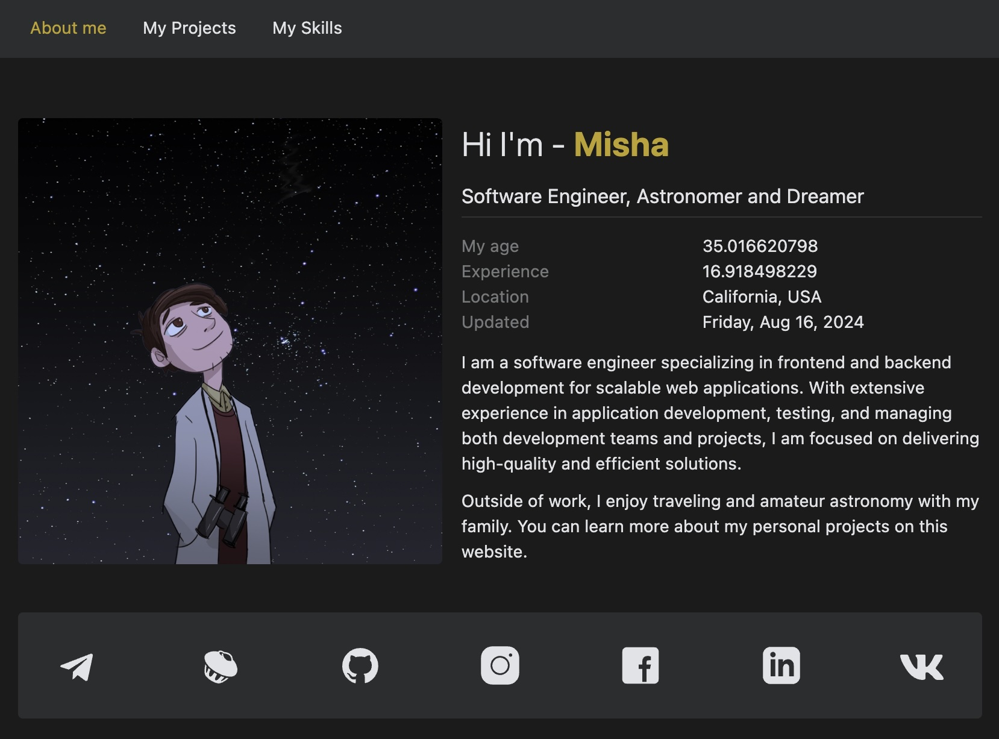

<a id="top"></a>

This project provides a fully customizable, modern developer portfolio template built with React and Next.js. Perfect for showcasing your skills, experience, and projects in a clean and professional design. Whether you’re a developer looking to create a personal brand or a freelancer needing a fast, responsive portfolio, this template offers everything you need.

<!-- PROJECT TITLE -->
<div align="center">

<h3>Create Your Personal Developer Portfolio</h3>
<a href="https://github.com/miksrv/developer-portfolio-website"><strong>Explore the docs »</strong></a>
<br /><br />
<a href="https://miksoft.pro" target="_blank">Demo</a>
·
<a href="https://github.com/miksrv/developer-portfolio-website/issues/new?assignees=miksrv&labels=bug&projects=&template=1-bug.yml&title=%5BBug%5D%3A+">Report Bug</a>
·
<a href="https://github.com/miksrv/developer-portfolio-website/issues/new?assignees=miksrv&labels=enhancement&template=2-feature-request.yml&title=%5BFeature%5D%3A+">Request Feature</a>
·
<a href="#contact">Contact</a>
</div>

<!-- PROJECT BADGES -->
<div align="center">

[![Contributors][contributors-badge]][contributors-url]
[![Forks][forks-badge]][forks-url]
[![Stargazers][stars-badge]][stars-url]
[![Issues][issues-badge]][issues-url]
[![MIT License][license-badge]][license-url]

[](https://github.com/miksrv/nextjs-vcard-project/actions/workflows/checks.yml)
[](https://github.com/miksrv/nextjs-vcard-project/actions/workflows/deploy.yml)

</div>

---

<!-- TABLE OF CONTENTS -->
### Table of Contents

- [Key Features](#key-features)
- [Why Use This Portfolio Template?](#why-use-this-portfolio-template)
- [About of Project](#about-of-project)
- [How to use](#how-to-use)

<!-- KEY FEATURES -->
## Key Features:
- **Built with React and Next.js**: Fast, scalable, and SEO-friendly framework.
- **Customizable Design**: Easily adjust the layout, colors, and sections to suit your needs.
- **Responsive Layout**: Optimized for all screen sizes, ensuring a seamless experience on any device.
- **Skills and Project Showcases**: Display your technical expertise and featured projects with progress bars, icons, and descriptions.
- **Smooth Animations**: Modern CSS animations to enhance the user experience.

<p align="right">
  (<a href="#top">Back to top</a>)
</p>

## Why Use This Portfolio Template?

- **Professional Presentation**: A portfolio is more than just a collection of work—it's a personal brand statement. With this template, you can professionally showcase your skills, projects, and expertise, leaving a lasting impression on potential employers or clients.

- **Boost Your Online Visibility**: In today’s digital world, a strong online presence is key to getting noticed. This portfolio is optimized for SEO, helping to increase your visibility in search engines, so your profile is more likely to be found by the right people.

- **Stand Out from Resumes**: A portfolio goes beyond a simple resume, offering a dynamic, interactive way to demonstrate your experience and technical knowledge. With engaging animations and structured project showcases, you can tell a compelling story about your professional journey.

- **Customizable and Easy to Use**: This template is built with React and Next.js, offering a clean codebase and a flexible structure that can be easily adapted to your unique needs. Whether you're a developer starting out or an experienced professional, it’s simple to personalize and deploy.

<p align="right">
  (<a href="#top">Back to top</a>)
</p>

<!-- ABOUT OF PROJECT -->

## About of Project

This project is a complete solution for building a high-quality developer portfolio website, perfect for showcasing your skills, projects, and experiences in a sleek and modern design. Built with React and Next.js, this template is optimized for performance and SEO, ensuring that your portfolio stands out not only in appearance but also in search engine visibility. It’s fully customizable, allowing you to adapt the design, structure, and content to match your personal branding or freelance work.



Designed with developers in mind, the template features dedicated sections for displaying technical skills with animated progress bars, detailed project showcases, and an about section to introduce yourself to potential clients or employers. The layout is fully responsive, ensuring a seamless experience across devices, from desktop to mobile. Additionally, the use of smooth CSS animations adds a dynamic feel to the portfolio, enhancing user engagement without sacrificing speed or performance.


Whether you’re looking to establish a strong online presence as a developer or need a professional portfolio to support your freelance career, this project offers the flexibility and functionality to create an impressive, personalized site. Easily deploy it to platforms like Vercel or host it on any provider supporting Next.js applications.


Feel free to use this repository for any purpose related to the development of virtual business cards. I am always ready to discuss any questions related to the use of this repository and help you in its work.

<p align="right">
  (<a href="#top">Back to top</a>)
</p>

## How to Use

1. **Install Prerequisites**: Ensure you have [NodeJS](https://nodejs.org/en/download/) and [Yarn](https://yarnpkg.com/getting-started/install) installed on your system.

2. **Clone the Repository**: Clone [this repository](https://github.com/miksrv/developer-portfolio-website.git) to your local machine:

   ```bash
   git clone https://github.com/miksrv/developer-portfolio-website.git
   ```

3. **Install Dependencies**: Navigate to the project directory and install all necessary dependencies:

   ```bash
   cd developer-portfolio-website
   yarn install
   ```

4. **Run the Development Server**: After the installation is complete, start the local development server:

   ```bash
   yarn dev
   ```

5. **Access the Application**: Open your browser and go to [http://localhost:3000/](http://localhost:3000/) to view the portfolio.

<!-- MARKDOWN VARIABLES (LINKS, IMAGES) -->
[contributors-badge]: https://img.shields.io/github/contributors/miksrv/developer-portfolio-website.svg?style=for-the-badge
[contributors-url]: https://github.com/miksrv/developer-portfolio-website/graphs/contributors
[forks-badge]: https://img.shields.io/github/forks/miksrv/developer-portfolio-website.svg?style=for-the-badge
[forks-url]: https://github.com/miksrv/developer-portfolio-website/network/members
[stars-badge]: https://img.shields.io/github/stars/miksrv/developer-portfolio-website.svg?style=for-the-badge
[stars-url]: https://github.com/miksrv/developer-portfolio-website/stargazers
[issues-badge]: https://img.shields.io/github/issues/miksrv/developer-portfolio-website.svg?style=for-the-badge
[issues-url]: https://github.com/miksrv/developer-portfolio-website/issues
[license-badge]: https://img.shields.io/github/license/miksrv/developer-portfolio-website.svg?style=for-the-badge
[license-url]: https://github.com/miksrv/developer-portfolio-website/blob/master/LICENSE.txt
